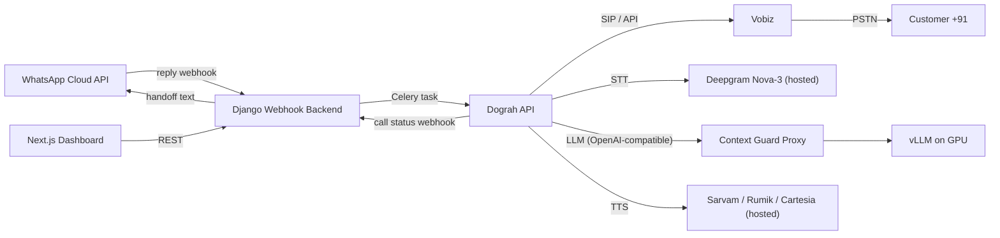

# WhatsApp-Triggered AI Caller (Hindi + Indian English)

## Architecture

Human-1 is left out on purpose because it has no system prompt, so it can't be held to the business context. The inference layer is swappable if a model that accepts prompts becomes available.

## Repo layout (new, in `AI_Caller/`)

- `backend/` - Django 5 + DRF + Celery + Redis + Postgres
  - `apps/tenants` - Organisation, users, encrypted credentials (WhatsApp token, Vobiz DID)
  - `apps/campaigns` - Campaign, structured context (offer, prices, FAQs, allowed topics, forbidden topics, handoff message, language)
  - `apps/whatsapp` - webhook verify/receive, signature check, reply-to-campaign matching
  - `apps/calls` - Lead, CallRequest, CallAttempt, Dograh client, status callbacks
  - `apps/compliance` - phone normalisation, calling window, opt-out/DND list, rate limits
- `context_guard/` - FastAPI proxy with an OpenAI-compatible `/v1/chat/completions`, placed between Dograh and vLLM
- `inference/` - vLLM Docker setup for the GPU (the language model only)
- `frontend/` - Next.js 15 + Tailwind + shadcn/ui
- `deploy/` - `docker-compose.yml` (app stack), `docker-compose.gpu.yml` (inference), Dograh compose override, Caddy (TLS), `.env.example`, VPC notes

## Task 1 (first deliverable): Webhook Service

- `GET /webhooks/whatsapp/` verifies `hub.mode` / `hub.verify_token` / `hub.challenge` for each tenant (URL carries the tenant slug).
- `POST /webhooks/whatsapp/<tenant>/` checks `X-Hub-Signature-256` using HMAC-SHA256 of the raw body with the app secret. It returns 200 immediately and hands processing to Celery.
- Idempotency: unique `wa_message_id` so Meta's retries don't create duplicate calls.
- Campaign matching, in priority order: the `context.id` the reply points back to (matched against the outbound template message IDs we stored), then the button `payload`, then a keyword rule, then the tenant's default campaign.
- Intent filter: "STOP" or "unsubscribe" adds the number to the opt-out list and skips the call. Otherwise create a Lead plus a CallRequest.
- Compliance checks before dialling:
  - Normalise to E.164 `+91XXXXXXXXXX` (mobile numbers start with 6-9).
  - Only dial 09:00-21:00 IST; replies outside that window are queued for the next window.
  - Check the opt-out list, allow at most one call per lead per campaign in 24 hours, and use the tenant's registered Vobiz DID as caller ID.
- Celery `initiate_call` task calls the Dograh outbound-call API with the workflow ID and `initial_context` variables (customer name, campaign ID, language). It retries with backoff.
- `POST /webhooks/dograh/` receives call status, transcript and disposition. When the disposition is `handoff_requested`, it sends a WhatsApp text and alerts the tenant's human team.

## Context isolation (the core guarantee)

- The campaign context is structured fields, not free text. `campaigns/prompt_compiler.py` builds a locked system prompt from them:
  - Answer only from the FACTS block.
  - Never invent prices, offers, dates or policies.
  - For anything outside the facts, say the handoff line and offer a callback or a text.
  - Reply in the caller's language (Hindi or Indian English, Hinglish allowed).
  - Keep replies to 1-2 short sentences.
- The Dograh workflow is kept minimal: its prompt only carries the `campaign_id` template variable. The actual rules are injected server-side.
- `context_guard` proxy, called for every LLM turn:
  1. Looks up the campaign by the `campaign_id` metadata, ignores whatever system prompt came in, and injects the compiled one.
  2. Streams tokens from vLLM, buffers them one sentence at a time and checks each sentence:
     - Any number or rupee amount must appear in the FACTS.
     - Nothing from the forbidden-topic list or a competitor name.
     - Script must be Devanagari or Latin.
  3. If a sentence fails, it's replaced with the handoff line and the violation is logged.
  4. Low temperature (0.2), a token cap, and a function the model can call to `request_handoff`.
- Eval harness `context_guard/tests/redteam/`: off-topic, price-probing and prompt-injection conversations in Hindi and English. CI fails on any leak.

## Speech and language providers

Speech-to-text and text-to-speech use hosted providers. Only the language model runs on your GPU, which keeps the context guard in your control.

- STT (hosted): Deepgram Nova-3 with `language=multi` for Hindi, English and Hinglish code-switching, streaming, with endpointing around 300ms. Fallback: Sarvam Saaras.
- TTS (hosted): configurable per campaign.
  - Default: Sarvam Bulbul (Hindi and Indian English voices, already a pipecat service).
  - Options: Rumik, Cartesia and ElevenLabs.
  - Rumik isn't built into Dograh or pipecat, so it gets a small adapter in `deploy/dograh-overrides/` once its streaming API is confirmed.
- LLM (self-hosted GPU): vLLM serving a Hindi-capable instruct model (default `Qwen2.5-7B-Instruct-AWQ`; configurable, e.g. Sarvam-M or Llama-3.1-8B), only reachable through `context_guard`.
- Provider keys are stored per tenant, encrypted, and passed into the Dograh workflow configuration. A platform-level default key is used if the tenant doesn't supply one.
- Latency budget: about 300ms STT endpointing, 150-250ms to the LLM's first token, 100-200ms to TTS first audio. Roughly 600-750ms end to end, all streamed. Use provider regions in or near India (Mumbai) to cut network round trips.
- Risk to check early: whether Dograh accepts a custom OpenAI-compatible base URL for the LLM (pointing at `context_guard`). If it doesn't, add a small provider adapter in the Dograh (pipecat) fork.

## Frontend (Next.js)

- Auth (sign up and organisation creation), onboarding wizard:
  1. Connect WhatsApp (WABA ID, phone number ID, access token, app secret; Meta Embedded Signup later).
  2. Connect Vobiz (DID, credentials).
  3. Optional: bring your own Deepgram or TTS keys and choose a voice.
  4. Business profile.
- Campaign editor: structured context form, language choice, handoff message, a "Preview prompt" button, and a "Test call to my number" button.
- Leads and calls dashboard: status, transcript, recording, disposition, context-violation log.

## Deployment (VPC)

- App VM: Caddy, Django, Celery, Redis, Postgres, Next.js, Dograh (its own compose file on the same Docker network).
- GPU VM (private subnet only): vLLM and context_guard. Only the app VM can reach it. The app VM needs outbound internet access to Deepgram and the TTS provider.
- Public ports: 443 (Caddy) and Vobiz media/SIP ports as Dograh requires. Secrets live in `.env`. Credentials are encrypted with Fernet at rest.